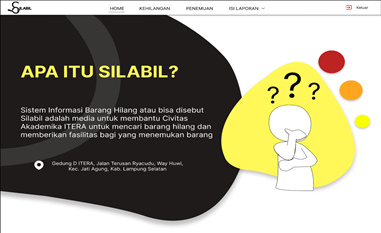
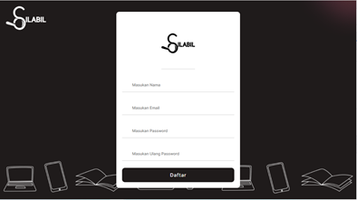
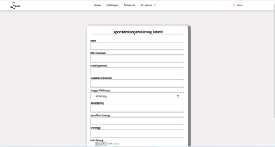

# SILABIL (Sistem Informasi Pencarian Barang Hilang)

Project : Sistem Informasi Barang Hilang
Deskripsi : Sebuah sistem informasi yang berfungsi untuk membantu mempermudah civitas akademika Institut Teknologi Sumatera dalam mengumpulkan informasi  tentang barang-barang hilang dan barang-barang yang ditemukan yang berada di dalam lingkup kampus. Sistem informasi ini mempermudah pengguna yang kehilangan barang untuk menemukan barangnya. Sistem ini juga menjembatani antara penemu barang dan user yang kehilangan barang dalam berkomunikasi melalu admin yang tersedia.

## Design Project
 
 
 
